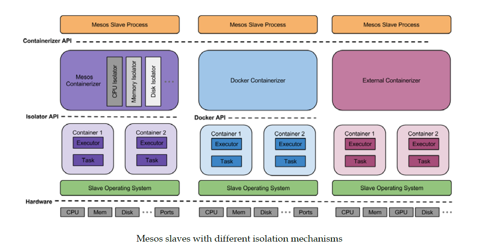

title: Mesos
date: 2015-10-08 17:08:21
tags: [mesos]
categories: [分布式]
---

## Mesos是什么 ##

[官网](http://mesos.apache.org/ "Mesos官网")

问题1. 集群部署主要在VM或者在物理层静态的进行资源划分, 如下图, 划分每3台主机作为一个集群运行各自的应用


此时从时间维度观察3个集群的资源利用情况, 如下图


可以观察到整个时间轴上, 整体资源利用率并不很高, 但是假设9台机器组成共享资源池, 每个应用在执行过程中从资源池中申请需要的资源并执行, 此时整体资源利用率相对提高

问题2. 分布式系统通过联合调度进行任务的执行，由协调器(负责协调在集群中执行想要运行的代码)和Worker(具体的功能代码)组成


在分布式系统中, 协调器与具体业务功能无关且各系统的协调器功能类似, 是否可以将协调器进行抽象并统一负责协调所有集群的任务执行, 实现一个分布式的协调系统

[Mesos](http://mesos.apache.org)是一个分布式的集群管理框架, 宗旨为尝试和提高集群的利用率和性能、提供通用的分布式系统框架.


Mesos框架本身只负责资源的分配, 而不负责资源的调度, 每个业务功能的调度器和mesos master API进行通信, mesos master根据剩余资源调度mesos slave执行相应的任务

好处:

1. 可以在一批机器上部署执行多个分布式系统, 动态划分(解决静态资源划分问题)和共享资源,  并且不用为每个分布式实现一套协调功能
2. 提供统一的分布式功能集(故障检测、分布式任务、任务启动、任务监控、结束任务、清理任务等)

## 架构 ##


说明：
1. mesos由framework、master、slave组成, fromework由调度器和执行器组成, 使用zookeeper来维护集群的高可用性和配置信息
2. mesos提供资源的抽象提供双层调度系统, master主要负责从slave收集资源并根据资源分配算法以resource offer(list<slaveid, cpu, mem, port等>)的方式提供的框架的调度器, 调度器接收resource offer并决定如何使用, 可以选择接受或者拒绝资源, 当全责接收资源时则发送TaskInfo(<list<slaveid, cpu, mem, port等>)信息给master，master经过检查下发给slave并由slave调用TaskInfo中指定的执行器来执行具体的任务。 流程图如下图：


## Mesos用来干什么 ##

先看下Mesos架构图:


将Mesos生态组件和Linux操作系统对比:


可以用来构建分布式的操作"系统", 即数据中心操作系统(DCOS), mesosphere公司使用mesos构建了Mesosphere DCOS

## 版本 ##

预言使用版本为: 0.24.0 (9月2日)
目前最新release版为: 0.24.1 (9月25日)
目前最新rc版为: 0.25.rc2 (10月6日)

每10天一个测试版, 每20天一个修正版本, 每40天一个子版本

## 开发语言&协议 ##

开发语言: C++
协议: Apache License Version 2.0
Mesos扩展模块开发: C++ 若想使用Python,Java,GO等其他语言，需要使用C++实现代理
框架开发: Python, Java, Go等

## 安装 ##

系统要求: 64位的linux或mac系统

安装:

1.源码编译安装(centos 7.0)
+ 编译环境准备

```
yum install -y tar wget

wget http://repos.fedorapeople.org/repos/dchen/apache-maven/epel-apache-maven.repo -O /etc/yum.repos.d/epel-apache-maven.repo

yum groupinstall -y "Development Tools"
echo "[WANdiscoSVN]" > /etc/yum.repos.d/wandisco-svn.repo
echo "name=WANdisco SVN Repo 1.9" >> /etc/yum.repos.d/wandisco-svn.repo
echo "enabled=1" >> /etc/yum.repos.d/wandisco-svn.repo
echo "baseurl=http://opensource.wandisco.com/centos/7/svn-1.9/RPMS/x86_64/" >> /etc/yum.repos.d/wandisco-svn.repo
echo "gpgcheck=1" >> /etc/yum.repos.d/wandisco-svn.repo
echo "gpgkey=http://opensource.wandisco.com/RPM-GPG-KEY-WANdisco" >> /etc/yum.repos.d/wandisco-svn.repo

yum groupinstall -y "Development Tools"

yum install -y apache-maven python-devel java-1.7.0-openjdk-devel zlib-devel libcurl-devel openssl-devel cyrus-sasl-devel cyrus-sasl-md5 apr-devel subversion-devel apr-util-devel

gcc --version
```

说明:
a. 在编译>=0.21版本的mesos时c++编译器必须完全支持c++11即gcc>=4.8.0
b. 在编译>=0.21版本的mesos需要使用subversion>=1.8的devel包, 而在centos中不提供, 需要手动添加svn源
c. mesos在运行中需要使用cyrus-sasl-md5和subversion

+ mesos编译&检查&安装

```
# 下载tar.gz包
wget http://apache.fayea.com/mesos/0.24.0/mesos-0.24.0.tar.gz

# 解压
tar zvxf mesos-0.24.0.tar.gz

# 编译准备
cd mesos-0.24.0
./boostrap

# 创建编译目录
mkdir build && cd build

# 生成编译配置
../configure

# 编译
make -j4

# 检查，可能需要使用sudo make check
make check

# 安装
make install

# 启动
cd bin && ./mesos-master.sh --ip=127.0.0.1 --work_dir=/tmp/test_mesos
cd bin && ./mesos-slave.sh --master=127.0.0.1:5050
# 待安装后也可以使用mesos-local进行启动，该命令会在本地启动一个master和一个slave

# 测试
cd src && ./test-framework --master=localhost:5050
cd src/examples/java && ./test-framework localhost:5050
cd src/examples/python && ./test-framework localhost:5050

# 访问webui
# http://localhost:5050
# mesos通过iptables限制其访问权限, 若不能访问需要查看并修改iptables的策略
```

+ 若需要使用mesos contraintorizer 的网络隔离功能则需要安装[libnl-3.2.26](https://github.com/tgraf/libnl)

```
#下载 libnl-3.2.25
wget https://codeload.github.com/tgraf/libnl/tar.gz/libnl3_2_26rc1 -O libnl3_2_26rc1.tar.gz

tar zvxf libnl3_2_26rc1.tar.gz
cd libnl-libnl3_2_26rc1
./autogen.sh
./configure
make -j4
make install

# 在生成mesos的编译文件时添加network参数,
../configure --with-network-isolator
```

2.通过mesosphere提供的rpm或deb安装包进行安装(centos 7.0)

下载地址: [https://open.mesosphere.com/downloads/mesos/](https://open.mesosphere.com/downloads/mesos/ "mesos rpm/deb安装包下载")

```
# mesos依赖包subversion, cyrus-sasl-md5需要提前安装
yum install subversion cyrus-sasl-md5

# 下载安装包&安装
wget http://downloads.mesosphere.io/master/centos/7/mesos-0.24.0-1.0.27.centos701406.x86_64.rpm

rpm -i mesos-0.24.0-1.0.27.centos701406.x86_64.rpm
```

说明:
a. 使用rpm安装包安装后, 会自动添加到启动服务中并随机器启动，可以通过systemctl命令进行控制

```
systemctl stop mesos-master.service
systemctl stop mesos-slave.service

systemctl start mesos-master.service
systemctl start mesos-slave.service
```

b. 在安装后mesos的配置文件会放置在/etc/mesos, /etc/mesos-master, /etc/mesos-slave三个目录下和/etc/default/mesos, /etc/defautl/mesos-master, /etc/default/mesos-slave三个文件

在mesos-master启动会检查messo和mesos-master配置文件中的ULIMIT, ZK, IP, PORT, CLUSTER, LOGS六个参数,并从加载/etc/mesos-master目录下的配置文件
在mesos-slave启动时会检测时umesos和mesos-slave配置文件中ULIMIT, MASTER, IP, LOGS, ISOLATION五个参数并从加载/etc/mesos-slave目录下的配置文件

在/etc/mesos/目录下只有zk配置文件用来配置zookeeper的地址, 由/etc/default/mesos-master和/etc/default/mesos-slave导入

在/etc/mesos-master和/etc/mesos-slave目录下分别是针对master和slave命令的参数进行配置，每一个文件对应一个参数, 文件名为参数名, 文件内容为参数值, 若参数无参数值则文件名使用?开头

3.通过mesosphere提供的源进行安装, [参考](https://mesosphere.com/downloads/)

## 配置 ##

可以通过mesos-master --help和mesos-slave --help查看master和slave支持的参数

master配置参数:

|参数名|参数值|默认值|
|------|------||
|--acls|授权控制||
|--advertise_ip|||
|--advertise_port|||
|--allocation_interval|将resource offer发送给framewrok的间隔|1s|
|--allocator|资源调度算法, 可通过modules进行扩展|HierarchicalDRF|
|--[no-]authenticate|是否对框架进行认证|false|
|--[no-]authenticate_slaves|是否对slave进行认证|false|
|--authenticator|framework和slave的认证方式,可通过modules进行扩展|crammd5|
|--authorizers|授权方式指定默认为local, 可以通过modules方式扩展, 此时--acls将不起效,  目前不能同时支持多种授权方式|
|--cluster|集群的名称, 显示在webui上|
|--credentials|用户认证配置|
|--external_log_file|指定日志文件, 用于记录webui和http api的相关日志|
|--firewall_rules|设置http api接口的访问限制|
|--framework_sorter|frame资源分配的策略|drf|
|--[no-]help|显示帮助信息|
|--hooks|配置hook扩展|
|--hostname|设置master或slave对外的主机名|
|--[no-]initialize_driver_logging|是否自动初始化framework执行器的日志|
|--ip|master绑定的IP地址|
|--ip_discovery_command||
|--[no-]log_auto_initialize|是否自动初始化relicated log, 若禁用, 则必须手动初始化|true|
|--log_dir|日志文件路径|
|--logbufsecs|log刷新时间间隔|0s|
|--logging_level|日志级别，可配置为'INFO', 'WARNING', 'ERROR'|INFO|
|--max_slave_ping_timeouts|设置slave响应master ping命令失败的次数,若超过次数则移除slave|5s|
|--modules|加载的模块信息|
|--offer_timeout|master发送offer的回收时间|
|--port|master监听的端口号|5050|
|--[no-]quiet|关闭日志到标准错误输出|false|
|--quorum|决策人数量当记录replicated log的master数量大于quorum是则成功, 配置一般大于master数量的一半, 若master为1却不适用zk则不用配置|
|--rate_limits|配置framework接口调用的限速|
|--recovery_slave_removal_limit|故障恢复时刻移除的slave最大比例|100%|
|--registry|register使用的持久化策略，可以选择replicated_log或in_momory|replicated_log|
|--registry_fetch_timeout|当fetch失败时再次发起fetch的时间|1min|
|--registry_store_timeout|当store失败时再次发起store的时间|5s|
|--[no-]registry_strict|是否拒绝slave重新注册或移除|false|
|--roles|配置集群就角色信息|
|--[no-]root_submissions|是否允许root提交框架|true|
|--slave_ping_timeout|设置slave响应master ping命令的超时时间|15s|
|--slave_removal_rate_limit|slave移除速率|
|--slave_reregister_timeout|master重新选举后, slave重新注册的超时时间|10min|
|--user_sorter|用户资源分配策略|drf|
|--[no-]version|显示版本信息|
|--webui_dir|web ui的文件目录|
|--weights|用来配置角色获取资源的权重信息|
|--whitelist|配置可接受offer的slave, 默认全部接受|
|--work_dir|控件工作的目录和replication log存放的路径|
|--zk|zookeeper地址zk://ip:password/mesos|
|--zk_session_timeout|zookeeper会话超时时间|10s|
|--max_executors_per_slave|设置每个slave上运行制执行器的最大个数|

slave的配置参数:

|参数名|参数值|默认值|
|------|------|------|
|--appc_store_dir|||
|--attributes|设置slave节点的属性列表, 调度器可以根据属性值作为调度的限制条件||
|--authenticatee|slave用来向master的认证方式|crammd5|
|--[no-]cgroups_cpu_enable_pids_and_tids_count||
|--[no-]cgroups_enable_cfs|开启cfs带宽限制特征对cpu进行硬件限制|false|
|--cgroups_hierarchy|cgroups的根路径|/sys/fs/cgroup|
|--[no-]cgroups_limit_swap|开启内测和交换区的限制|false|
|--cgroups_root|根cgroups的名字|mesos|
|--container_disk_watch_interval|周期检查容器磁盘配合的时间间隔,posix/disk隔离器使用该配置|15s|
|--containerizer_path|设置外部容器的可执行文件, 需要和--isolation=external一起作用||
|--containerizers|设置使用的容器机支持mesos,external,docker, 在启动时会按照顺序进行尝试启动, 若使用docker则需要在启动时设置为docker,mesos|mesos|
|--credential|master认证的用户信息配置文件||
|--default_container_image|设置外部容器及使用的默认镜像，需要和--isolation=external一起作用|
|--default_container_info|在ExecutorInfo中未显示指定ContainerInfo时使用的默认ContainerInfo|
|--default_role|在--resouces中角色的默认值|*表示所有角色都有访问资源的权限|
|--disk_watch_interval|周期性检查磁盘使用率的时间间隔|1min|
|--docker|Docker可执行文件位置|docker|
|--[no-]docker_kill_orphans||
|--docker_mesos_image||
|--docker_remove_delay|在删除Docker容器前的等待时间|6h|
|--docker_socket||
|--docker_stop_timeout|docker停止实例的超时时间, 如果实例在时间内未停止则kill掉|0s|
|--[no-]enforce_container_disk_quota|开启容器磁盘配额功能, posix/disk隔离器使用该配置|false|
|--executor_environment_variables||
|--executor_registration_timeout|执行器和slave注册的超时时间|1min|
|--executor_shutdown_grace_period|执行器关闭时间|5s|
|--external_log_file||
|--fetcher_cache_dir||
|--fetcher_cache_size||
|--firewall_rules|设置http api接口的访问限制|
|--frameworks_home|附加在执行器相对URI前的路径|
|--gc_delay|执行器工作目录的垃圾回收时间,当磁盘使用率低时可能提前回收|1week|
|--gc_disk_headroom|执行器目录回收时间每隔disk_watch_interval时间目录的课存储时间则更新gc_delay * max(0, 1-gc_disk_headroom - disk_usage)|0.1|
|--hadoop_home|设置hadoop_home的路径, 用来从hdfs获取执行器|
|--[no-]help|显示帮助信息|
|--hooks|设置hook模块|
|--hostname|设置master的主机信息|
|--[no-]initialize_driver_logging||
|--ip|设置绑定的ip地址|
|--ip_discovery_command||
|--isolation|设置使用的隔离机制可以选择posix/cpu,posix/mem，若使用cgroup则需要设置为cgroup/cpu,cgroup/mem|posix/cpu,posix/mem|
|--launcher_dir|mesos二进制文件位置|/usr/local/bin/mesos|
|--log_dir|设置log目录|
|--logbufsecs|设置log刷新时间|0s|
|--logging_level|设置log级别|INFO|
|--master|设置master的地址或zookeeper的地址|
|--modules|设置加载的模块|
|--oversubscribed_resources_interval||
|--perf_duration|每次性能状态的采集时间, 必须小余perf_interval|10s|
|--perf_events|pref_event隔离器使用的容器性能采集事件|
|--perf_interval|性能状态采集的时间间隔|1min|
|--port|设置监听端口号|5050|
|--provisioners||
|--qos_controller||
|--qos_correction_interval_min||
|--[no-]quiet|设置是否关闭日志到标准错误输出|false|
|--recover|设置恢复策略, 可以设置为重新连接和清理, 重连指slave与运行的执行器重新连接, 清理是指关闭所有的执行器并以一个新的slave向master注册|reconnect|
|--recovery_timeout|等待slave恢复的超时时间，若超过时间则所有的执行器则自杀|15min|
|--registration_backoff_factor|在slave启动后随机等待[0, registration_backoff_factor]时间后再向master发起注册信息|1s|
|--resource_estimator||
|--resource_monitoring_interval|执行器资源使用监控的时间间隔|1s|
|--resources|设置为每个角色提供的资源信息，格式为resouce(role):value, 多个资源之间用分号分割|
|--[no-]revocable_cpu_low_priority||false|
|--sandbox_directory|沙盒目录映射到容器内目录的路径|/mnt/mesos/sandbox|
|--slave_subsystems|slave运行时的cgroup子系统包括memory,cpuacct等，使用逗号分割|
|--[no-]strict|检查恢复过程|true|
|--[no-]switch_user|检查是以提交任务的用户身份还是slave运行的身份执行任务|true|
|--[no-]version|显示版本信息|
|--work_dir|设置框架工作目录|/tmp/mesos|
|--ephemeral_ports_per_container|网络隔离器分配给每个容器临时端口数量，必须为2的幂次|1024|
|--eth0_name|设置公共网络接口名称|
|--lo_name|设置环回网络接口名称|
|--egress_rate_limit_per_container|限制容器的出口网络流量，单位为b/s, 如果未指定或设置为0表示不限制|
|--[no-]network_enable_socket_statistics_summary||fallse|
|--[no-]network_enable_socket_statistics_details||false|

## 认证、授权 ##

用户: 用于master对framework和slave的认证
角色: 
1. 将framework分类
    在框架注册时，必须指定框架注册的角色信息，在资源分配是作为框架的属性进行影响分配结果
2. 将用户分类
    用于定义某(些)用户对框架的操作信息, 比如注册、下线等
3. 将资源分类
    在slave上配置, 用于指定资源只能由某角色使用
操作: 主要用于限制framework的注册(register_frameworks)，运行(run_tasks)，下线(shutdown_frameworks)三种操作对应
框架名称: 在框架向master注册时设置其名称

任务执行用户: 在slave上执行任务的系统用户

使用:

master启动:
```
mesos-master --ip=192.168.56.101 --zk=zk://localhost:2181/mesos --quorum=1 --work_dir=/var/lib/mesos --log_dir=/var/log/mesos --hostname=192.168.56.101 --cluster=mesos --authenticate=true --authenticate_slaves=true --authenticators=crammd5 --credentials=/root/run/credentials --roles=marathon_role,chronos_role --acls=/root/run/acls.json
```

参数说明:
1. --authenticators=crammd5
    设置认证方式
2. --credentials=/root/run/credentials
    设置用户名密码
    文件内容:
    ```
    user1 password1
    user2 password2
    marathon_user marathon_password
    chronos_user chronos_password
    framework_user framework_password
    ```
    每行对应一个用户名和密码信息

3. --authenticate=true
    设置在framewrok注册时对用户进行认证
4. --authenticate_slaves=true
    设置在slave注册时对用户进行认证
5. --roles=marathon_role,chronos_role
    设置角色列表
6. --acls=/root/run/acls.json
    设置访问权限
    文件内容:
```
{   
    "permissive" : false,
    "register_frameworks" : [
        {
            "principals" : {
                "values" : ["marathon_user"]
            },
            "roles" : {
                "values" : ["marathon_role"]
            }
        },
        {
            "principals" : {
                "values" : ["chronos_user"]
            },
            "roles" : {
                "values" : ["chronos_role"]
            }
        }
    ],
    "run_tasks" : [
        {
            "principals" : {
                "values" : ["marathon_user", "chronos_user"]
            },
            "users" : {
                "values" : ["root"]
            }
        }
    ],
    "shutdown_frameworks" : [
        {
            "principals": {
                "values": ["framework_user"]
            },
            "framework_principals": {
                "type": "ANY"
            }
        }
    ]
}
```
解释：
1. 框架只能由用户marathon_user以marathon_role角色或用户chronos_user以chronos_role角色像master发起注册
2. 框架只能使用户只能使用marathon_user和chronos_user且以root系统用户运行任务
3. 只允许framework_user通过restapi关闭所有的框架下线
4. 在json配置中有value有两种设置可以是values或者type，values对应具体的用户名、角色、框架名称、系统用户。type对应范式匹配可设置为NONE或ANY，分别表示没有任何值和所有值

slave启动
```
mesos-slave --ip=192.168.56.102 --hostname=192.168.56.102 --master=zk://192.168.56.101:2181/mesos --containerizers=docker,mesos --log_dir=/var/log/mesos --work_dir=/var/lib/mesos --authenticatee=crammd5 --credential=credential
```
参数说明：
1. --authenticatee=crammd5
    设置认证方式
2. --credential=credential
    设置用户名密码信息
    文件内容:
    ```
    user2 password2
    ```

框架启动需要指定参数(以marathon, chronos为例)：
marathon:
```
./start --master zk://localhost:2181/mesos --zk zk://localhost:2181/marathon --hostname 192.168.56.101 --framework_name marathon --mesos_user root --mesos_role marathon_role --mesos_authentication_principal marathon_user --mesos_authentication_secret_file /root/marathon-0.10.0/bin/mesos_secret
```
1. --framework_name marathon
设置框架名称
2. --mesos_user root
设置框架创建任务在slave上运行的系统用户
3. --mesos_role marathon_role
设置框架的角色
4. --mesos_authentication_principal marathon_user
设置框架的认证用户名
5. --mesos_authentication_secret_file /root/marathon-0.10.0/bin/mesos_secret
设置框架的认证用户密码，需要注意文件中只能包含名称，不能包含换行字符和空格

chronos:
```
./start-chronos.bash --master zk://localhost:2181/mesos --zk_hosts zk://localhost:2181 --http_port 8081 --mesos_framework_name chronos --user root --mesos_role chronos_role --mesos_authentication_principal chronos_user --mesos_authentication_secret_file /root/chronos-2.4.0/bin/mesos_secret
```
1. --mesos_framework_name chronos
设置框架名称
2. --user root
设置框架创建的任务在slave上运行的系统用户
3. --mesos_role chronos_role
设置框架角色
4. --mesos_authentication_principal chronos_user
设置框架的认证用户名
5. --mesos_authentication_secret_file /root/chronos-2.4.0/bin/mesos_secret
设置框架的认证密码，需要注意文件中只能包含名称，不能包含换行字符和空格

使用curl下线框架的示例
```
curl -XPOST "http://192.168.56.101:5050/master/teardown" --login-options AUTH=CRAM-MD5 --user "framework_user:framework_password" -d "frameworkId=20151019-154324-1698212032-5050-8277-0000" -v
```

## 资源隔离 ##

mesos采用插件的方式提供多种隔离机制, 以便为不同的任务提供沙盒环境



说明:
mesos以Containerizer API的方式支持不同的容器机实现, 目前mesos支持mesos containerizer, docker containerizer和external containerizer, 默认使用mesos containerizer, 通过external containerizer我们可以自己实现自己的容器机和隔离器

+ mesos containerizer

mesos containerizer是mesos自己实现的容器机, 提供两种类型的隔离器: 基于posix系统的进程级别格式和基于linux内核特性cgroups隔离，containerizer通过isolator api对两种隔离器进行控制。

cgroups本身提供cpu和mem的隔离，在mesos containerizer还另外提供了磁盘隔离，共享文件系统隔离和PID namespace隔离

+ docker containerizer

mesos>=0.20原生支持docker, docker containerizer主要工作是将任务或执行器的启动和销毁过程翻译成对应的Docker CLI命令(docker可支持remote api操作)

使用:
1. 在slave节点安装docker cli
2. 在启动slave时在参数containerizers中添加docker或直接设置为docker
3. 设置iptables
    `iptables -A INPUT -s 172.17.0.0/16 -i docker0 -p tcp -j ACCEPT`
4. docker镜像可以以任务或者执行器的方式启动

+ external containerizer

资源的隔离由开发者进行实现和管理, 由外部容器机和外部容器机程序，外部容器机在mesos中已经提供并提供了基于mesos slave外部插件的容器API，程序员需要实现外部容器机程序，外部容器使用shell方式调用外部容器机, 参数通过stdin和stdout传递

需要在启动slave时指定--isolation=external和--containerizer_path=/path/to/external/containterizer

## 容错 ##

framework-->master-->(slave->executor->task)

1. framework宕机(调度器)
    a. framework挂掉不会影响已有任务的执行
    b. 若master实现故障恢复功能, 会重新向master注册并获取所有任务的状态信息

3. master宕机
    a. mesos使用zookeeper作为选举服务
    b. master使用选举leader保证高可用, 当leader挂掉, 会根据选举算法选出新的leader, 所有framework和slave会向重新新的master进行注册, 而不影响以后框架调度器、slave、执行器和任务不受影响

4. slave宕机:
    a. master发送slave宕机事件给framework, framewrok决定是否调度任务到健康的slave上
    b. slave恢复后，会向master重新注册

5. slave进程挂掉
    a. 不会影响执行器, 待slave重启后会恢复任务, 若执行器检查slave恢复时间超过限制则自杀

6. 执行器或者任务挂掉
    a. 执行器挂掉或者任务挂掉，slave会给master反馈任务执行失败, framework会接收到master发回的事件, 决定任务重新调度

## 故障 ##

mesos集群通过与zookeeper的连接是否超时判断组件的故障状态, 可将mesos组件分为竞争者和观察者, 框架和slave是观察者, master即使观察者又是竞争者, 默认配置为10s

1. slave与zookeeper连接超时, slave不会接收任何master发送的任务消息, 当连接恢复slave会重新接收和处理master发送的信息, 在过程中master无论是否重新选举
2. framewrok调度器驱动和zookeeper连接超时, 则调度器驱动会通知调度器, 由调度器决定
3. master与zookeeper连接超时
    a. master为leader, 则自杀, 其他守护模式的master进行重新选举, 可以用daemon的方式将master进行守护
    b. master为守护模式, 则等待
4. master和slave连接超时, master会将slave设置为未激活状态, 设置任务LOST, 将任务状态返回给框架调度器， 为激活状态的slave不会像master重新注册并且会被之后的消息要求主动关闭可以用daemon的方式将slave进行守护)

问题：
1. slave在master故障时出错, 新选举的master并不值得slave和运行在slave上任务的存在, 导致framework不能正常知道任务的状态信息(框架认为任务正常，而master不清楚任务在历史上的存在)
2. master在slave故障时出错, slave在master leader选举成功后恢复, 此时新的master并不值得slave的存在允许其以一个新的身份注册, 导致framework和master信息不一致(framework并不知道slave上已经运行的任务)

mesos使用registry持久化已经注册的slave信息, 当slave在注册、重新注册和删除时会查看和修改registry数据，目前实现为内存(zookeeper)、LevelDB、Replicatedlog三种方式

若slave的信息不存在于registery中时不允许器重新注册

## 资源分配&调度 ##

mesos采用双层调度方案, master决定将多少资源分配给framework, 如何使用由framework决定, 流程：
1. 框架向master注册
2. master从slave获取资源offer，调用分配模块函数决定将资源分配给哪个框架
3. 框架调度器接收资源offer，检查offer是否合适，若合适接受offer并发送task列表给master，若不合适则拒绝该offer
4. master得到框架的接受、拒绝消息，若接受则并做相应的检查后将task信息发送给对应的slave
5. slave分配所请求的资源并运行任务执行器，执行器运行框架下的任务
6. 框架调度器接收任务任务运行状态，同时框架调度器继续接收offer并在合适的时机启动任务
7. 框架注销后不在接收任何offer

Mesos通过支配资源公平算法(DRF)进行资源分配
概念：
最大-最小资源公平算法：
支配资源：在总资源比例最大的资源类型
支配比例：支配资源所在总资源的比例
例如：总资源为<8 CPU, 32 G>，框架A申请<2CPU, 1G>， 则支配资源为max([2/8, 1/32])，即cpu为支配资源，其支配比例为25%
DRF算法是在每个框架的支配资源上在利用最大-最小资源公平算法进行资源分配

Mesos FrameworkInfo中的用户角色可以用来决定资源的分配，可以每个用户或者每个框架一个角色，或者多个用户和框架共享一个角色，若未显示设置，则为运行框架调度器的用户

加权DRF：
在Mesos master启动时可以通过--weights和--roles设置加权DRF, --weights后接角色/权重列表格式为role1=weight1,权重为非整数，且roles中设置的角色必须都在weights设置权重

静态预留：
在slave上可以通过resource参数设置某部分资源只能由某角色使用，格式为name(role)value的列表，若没有指定角色的资源和未出现的资源将被划分到默认角色下, 例如
--resources="cpus:4;mem:2048;cpus(product):8;mem(product):4096"
指将8个cpu，4096M内存的slave预留给product角色
修改resources属性后需要重启slave

动态预留:
在framework接受到offer可以发送Offer::Operations::Reserve和Offer::Operations::Unreserve管理预留资源
也可以通过/reserve和/unreserve两个restapi对资源预留进行管理，此时不需要重启slave

## 开发 ##

### mesos扩展 ###

代码位置: /include/mesos/module
1. 认证
    见authenticatee.hpp, authorizer.hpp
    用于扩展第三方鉴权机制

2. 资源分配
    用于扩展资源分配机制，可以扩展资源分配算法和为内建层级分配器实现新的排序算法(用户和框架)

    代码接口详见/include/mesos/master/allocator.hpp(hirerarchical.hpp实现默认分配算法)
```
class Allocator
{
public:
  // Attempts either to create a built-in DRF allocator or to load an
  // allocator instance from a module using the given name. If Try
  // does not report an error, the wrapped Allocator* is not null.
  static Try<Allocator*> create(const std::string& name);

  Allocator() {}

  virtual ~Allocator() {}

  //初始化分配器
  virtual void initialize(
      const Duration& allocationInterval,
      const lambda::function<
          void(const FrameworkID&,
               const hashmap<SlaveID, Resources>&)>& offerCallback,
      const lambda::function<
          void(const FrameworkID&,
               const hashmap<SlaveID, UnavailableResources>&)>&
        inverseOfferCallback,
      const hashmap<std::string, RoleInfo>& roles) = 0;

  //在分配机制中添加框架
  virtual void addFramework(
      const FrameworkID& frameworkId,
      const FrameworkInfo& frameworkInfo,
      const hashmap<SlaveID, Resources>& used) = 0;

  //从分配机制中移除框架
  virtual void removeFramework(
      const FrameworkID& frameworkId) = 0;

  //激活指定框架
  // Offers are sent only to activated frameworks.
  virtual void activateFramework(
      const FrameworkID& frameworkId) = 0;

  //暂停指定框架
  virtual void deactivateFramework(
      const FrameworkID& frameworkId) = 0;

  //更新框架信息
  virtual void updateFramework(
      const FrameworkID& frameworkId,
      const FrameworkInfo& frameworkInfo) = 0;

  // Note that the 'total' resources are passed explicitly because it
  // includes resources that are dynamically "checkpointed" on the
  // slave (e.g. persistent volumes, dynamic reservations, etc). The
  // slaveInfo resources, on the other hand, correspond directly to
  // the static --resources flag value on the slave.

  //在分配机制中添加slave
  virtual void addSlave(
      const SlaveID& slaveId,
      const SlaveInfo& slaveInfo,
      const Option<Unavailability>& unavailability,
      const Resources& total,
      const hashmap<FrameworkID, Resources>& used) = 0;

  //从分配机制中移除slave
  virtual void removeSlave(
      const SlaveID& slaveId) = 0;

  // Note that 'oversubscribed' resources include the total amount of
  // oversubscribed resources that are allocated and available.
  // TODO(vinod): Instead of just oversubscribed resources have this
  // method take total resources. We can then reuse this method to
  // update slave's total resources in the future.

  //更新slave信息
  virtual void updateSlave(
      const SlaveID& slave,
      const Resources& oversubscribed) = 0;

  //激活指定的slave
  // Offers are sent only for activated slaves.
  virtual void activateSlave(
      const SlaveID& slaveId) = 0;

  //暂停指定的slave
  virtual void deactivateSlave(
      const SlaveID& slaveId) = 0;

  //更新slave白名单列表
  virtual void updateWhitelist(
      const Option<hashset<std::string>>& whitelist) = 0;

  //当框架接收指定资源请时触发的动作
  virtual void requestResources(
      const FrameworkID& frameworkId,
      const std::vector<Request>& requests) = 0;

  //更新指定框架在指定slave上的资源分配
  virtual void updateAllocation(
      const FrameworkID& frameworkId,
      const SlaveID& slaveId,
      const std::vector<Offer::Operation>& operations) = 0;

  //
  virtual process::Future<Nothing> updateAvailable(
      const SlaveID& slaveId,
      const std::vector<Offer::Operation>& operations) = 0;

  // We currently support storing the next unavailability, if there is one, per
  // slave. If `unavailability` is not set then there is no known upcoming
  // unavailability. This might require the implementation of the function to
  // remove any inverse offers that are outstanding.
  virtual void updateUnavailability(
      const SlaveID& slaveId,
      const Option<Unavailability>& unavailability) = 0;

  // Informs the allocator that the inverse offer has been responded to or
  // revoked. If `status` is not set then the inverse offer was not responded
  // to, possibly because the offer timed out or was rescinded. This might
  // require the implementation of the function to remove any inverse offers
  // that are outstanding. The `unavailableResources` can be used by the
  // allocator to distinguish between different inverse offers sent to the same
  // framework for the same slave.
  virtual void updateInverseOffer(
      const SlaveID& slaveId,
      const FrameworkID& frameworkId,
      const Option<UnavailableResources>& unavailableResources,
      const Option<InverseOfferStatus>& status,
      const Option<Filters>& filters = None()) = 0;

  // Retrieves the status of all inverse offers maintained by the allocator.
  virtual process::Future<
      hashmap<SlaveID, hashmap<FrameworkID, mesos::master::InverseOfferStatus>>>
    getInverseOfferStatuses() = 0;

  //从指定框架回收资源触发
  // Informs the Allocator to recover resources that are considered
  // used by the framework.
  virtual void recoverResources(
      const FrameworkID& frameworkId,
      const SlaveID& slaveId,
      const Resources& resources,
      const Option<Filters>& filters) = 0;

  //框架想要重新获得之前所排查的资源offer
  // Whenever a framework that has filtered resources wants to revive
  // offers for those resources the master invokes this callback.
  virtual void reviveOffers(
      const FrameworkID& frameworkId) = 0;
  
  // 资源offer分配超时
  // Informs the allocator to stop sending resources for the framework
  virtual void suppressOffers(
      const FrameworkID& frameworkId) = 0;
};
```
使用: --allocator指定资源分配模块

    代码详见: /src/master/allocator/sorter/sorter.hpp(drf/sorter.hpp中实现公平分配并支持带权值优先级)

```
class Sorter
{
public:
  virtual ~Sorter() {}

  //从分配算法中增加某个client
  // Adds a client to allocate resources to. A client
  // may be a user or a framework.
  virtual void add(const std::string& client, double weight = 1) = 0;

  //从分配算法删除某个client
  // Removes a client.
  virtual void remove(const std::string& client) = 0;

  //从排序器增加某个client
  // Readds a client to the sort after deactivate.
  virtual void activate(const std::string& client) = 0;

  //从排序器移除某个client
  // Removes a client from the sort, so it won't get allocated to.
  virtual void deactivate(const std::string& client) = 0;

  // Specify that resources have been allocated to the given client.
  virtual void allocated(
      const std::string& client,
      const SlaveID& slaveId,
      const Resources& resources) = 0;

  // Updates a portion of the allocation for the client, in order to
  // augment the resources with additional metadata (e.g., volumes)
  // This means that the new allocation must not affect the static
  // roles, or the overall quantities of resources!
  virtual void update(
      const std::string& client,
      const SlaveID& slaveId,
      const Resources& oldAllocation,
      const Resources& newAllocation) = 0;

  // Specify that resources have been unallocated from the given client.
  virtual void unallocated(
      const std::string& client,
      const SlaveID& slaveId,
      const Resources& resources) = 0;

  // Returns the resources that have been allocated to this client.
  virtual hashmap<SlaveID, Resources> allocation(const std::string& client) = 0;

  // Returns the clients that have allocations on this slave.
  virtual hashmap<std::string, Resources> allocation(
      const SlaveID& slaveId) = 0;

  //返回分配给某个client的资源
  // Returns the given slave's resources that have been allocated to
  // this client.
  virtual Resources allocation(
      const std::string& client,
      const SlaveID& slaveId) = 0;

  //在资源池中添加slave资源
  // Add resources to the total pool of resources this
  // Sorter should consider.
  virtual void add(const SlaveID& slaveId, const Resources& resources) = 0;

  //在资源池中移除slave资源
  // Remove resources from the total pool.
  virtual void remove(const SlaveID& slaveId, const Resources& resources) = 0;

  ////更新资源池中slave资源
  // Updates the total pool of resources.
  virtual void update(const SlaveID& slaveId, const Resources& resources) = 0;

  //按排序算法对client进行排序
  // Returns a list of all clients, in the order that they
  // should be allocated to, according to this Sorter's policy.
  virtual std::list<std::string> sort() = 0;

  // Returns true if this Sorter contains the specified client,
  // either active or deactivated.
  virtual bool contains(const std::string& client) = 0;

  // Returns the number of clients this Sorter contains,
  // either active or deactivated.
  virtual int count() = 0;
};
```

3. 隔离
    见isolator.hpp
    提供新的隔离方式和监控机制

4. 匿名
    见anonymous.hpp
    与master和slave启动时被加载, 与父进程共同存在, 不会扩展或替代mesos已有的功能

5. hook
    见/include/mesos/hook.hpp
    通过hook扩展组件的功能

    使用--hooks选项设置hook列表

模块通过在master和slave时通过参数--modules指定json文件来设置模块加载及配置, json文件格式:
```
{
    "libraries" : [
        {
            "file" : "",
            "name" : "",
            "modules" : [
                {
                    "name" : "",
                    "parameters" : [
                        {
                            "key" : "",
                            "value" : ""
                        }
                    ]
                }
            ]
        }
    ]
}
```

### mesos开发 ###
消息
    mesos各组件之间使用protocol buffer定义发送的消息，所有消息格式见代码/include/mesos/mesos.proto

框架
    + 调度器 & 调度驱动
        负责管理框架所获得的资源, 代码见/include/mesos/scheduler/scheduler.hpp

```
class Scheduler
{
public:
  // Empty virtual destructor (necessary to instantiate subclasses).
  virtual ~Scheduler() {}

  //mesos进行注册时被回调
  // Invoked when the scheduler successfully registers with a Mesos
  // master. A unique ID (generated by the master) used for
  // distinguishing this framework from others and MasterInfo with the
  // ip and port of the current master are provided as arguments.
  virtual void registered(
      SchedulerDriver* driver,
      const FrameworkID& frameworkId,
      const MasterInfo& masterInfo) = 0;

  //当重新选举mesos master后，被回调重新进行注册
  // Invoked when the scheduler re-registers with a newly elected
  // Mesos master. This is only called when the scheduler has
  // previously been registered. MasterInfo containing the updated
  // information about the elected master is provided as an argument.
  virtual void reregistered(
      SchedulerDriver* driver,
      const MasterInfo& masterInfo) = 0;

  //在调度器和master被断开时被回调
  // Invoked when the scheduler becomes "disconnected" from the master
  // (e.g., the master fails and another is taking over).
  virtual void disconnected(SchedulerDriver* driver) = 0;

  //在master向framework提供资源offer时调用
  // Invoked when resources have been offered to this framework. A
  // single offer will only contain resources from a single slave.
  // Resources associated with an offer will not be re-offered to
  // _this_ framework until either (a) this framework has rejected
  // those resources (see SchedulerDriver::launchTasks) or (b) those
  // resources have been rescinded (see Scheduler::offerRescinded).
  // Note that resources may be concurrently offered to more than one
  // framework at a time (depending on the allocator being used). In
  // that case, the first framework to launch tasks using those
  // resources will be able to use them while the other frameworks
  // will have those resources rescinded (or if a framework has
  // already launched tasks with those resources then those tasks will
  // fail with a TASK_LOST status and a message saying as much).
  virtual void resourceOffers(
      SchedulerDriver* driver,
      const std::vector<Offer>& offers) = 0;

  /根据不同的分配器，可能将一个资源分配给多个框架，但是第一个响应master的framework会得到资源，其他framework会被回调表示master撤销某资源offer, 若framework在收到该请求之前已经返回taskinfo，则在task状态中将受到taskstatus为lost状态
  // Invoked when an offer is no longer valid (e.g., the slave was
  // lost or another framework used resources in the offer). If for
  // whatever reason an offer is never rescinded (e.g., dropped
  // message, failing over framework, etc.), a framework that attempts
  // to launch tasks using an invalid offer will receive TASK_LOST
  // status updates for those tasks (see Scheduler::resourceOffers).
  virtual void offerRescinded(
      SchedulerDriver* driver,
      const OfferID& offerId) = 0;

  //任务状态发生变化回调
  // Invoked when the status of a task has changed (e.g., a slave is
  // lost and so the task is lost, a task finishes and an executor
  // sends a status update saying so, etc). If implicit
  // acknowledgements are being used, then returning from this
  // callback _acknowledges_ receipt of this status update! If for
  // whatever reason the scheduler aborts during this callback (or
  // the process exits) another status update will be delivered (note,
  // however, that this is currently not true if the slave sending the
  // status update is lost/fails during that time). If explicit
  // acknowledgements are in use, the scheduler must acknowledge this
  // status on the driver.
  virtual void statusUpdate(
      SchedulerDriver* driver,
      const TaskStatus& status) = 0;

  //向调度器传递执行器发送的消息，调度器可以访问执行器和slavede Id, 以及调度器所发送的数据
  // Invoked when an executor sends a message. These messages are best
  // effort; do not expect a framework message to be retransmitted in
  // any reliable fashion.
  virtual void frameworkMessage(
      SchedulerDriver* driver,
      const ExecutorID& executorId,
      const SlaveID& slaveId,
      const std::string& data) = 0;

  //当slave丢失时回调
  // Invoked when a slave has been determined unreachable (e.g.,
  // machine failure, network partition). Most frameworks will need to
  // reschedule any tasks launched on this slave on a new slave.
  virtual void slaveLost(
      SchedulerDriver* driver,
      const SlaveID& slaveId) = 0;

  //执行器丢失是回调
  // Invoked when an executor has exited/terminated. Note that any
  // tasks running will have TASK_LOST status updates automagically
  // generated.
  virtual void executorLost(
      SchedulerDriver* driver,
      const ExecutorID& executorId,
      const SlaveID& slaveId,
      int status) = 0;

  //当发送错误时调用，常用于清理工作
  // Invoked when there is an unrecoverable error in the scheduler or
  // scheduler driver. The driver will be aborted BEFORE invoking this
  // callback.
  virtual void error(
      SchedulerDriver* driver,
      const std::string& message) = 0;
};


// Abstract interface for connecting a scheduler to Mesos. This
// interface is used both to manage the scheduler's lifecycle (start
// it, stop it, or wait for it to finish) and to interact with Mesos
// (e.g., launch tasks, kill tasks, etc.). See MesosSchedulerDriver
// below for a concrete example of a SchedulerDriver.
class SchedulerDriver
{
public:
  // Empty virtual destructor (necessary to instantiate subclasses).
  // It is expected that 'stop()' is called before this is called.
  virtual ~SchedulerDriver() {}

  //启动调度器
  // Starts the scheduler driver. This needs to be called before any
  // other driver calls are made.
  virtual Status start() = 0;

  //停止驱动
  // Stops the scheduler driver. If the 'failover' flag is set to
  // false then it is expected that this framework will never
  // reconnect to Mesos. So Mesos will unregister the framework and
  // shutdown all its tasks and executors. If 'failover' is true, all
  // executors and tasks will remain running (for some framework
  // specific failover timeout) allowing the scheduler to reconnect
  // (possibly in the same process, or from a different process, for
  // example, on a different machine).
  virtual Status stop(bool failover = false) = 0;

  // Aborts the driver so that no more callbacks can be made to the
  // scheduler. The semantics of abort and stop have deliberately been
  // separated so that code can detect an aborted driver (i.e., via
  // the return status of SchedulerDriver::join, see below), and
  // instantiate and start another driver if desired (from within the
  // same process). Note that 'stop()' is not automatically called
  // inside 'abort()'.
  virtual Status abort() = 0;

  //等待驱动退出发送abort和stop动作
  // Waits for the driver to be stopped or aborted, possibly
  // _blocking_ the current thread indefinitely. The return status of
  // this function can be used to determine if the driver was aborted
  // (see mesos.proto for a description of Status).
  virtual Status join() = 0;

  //依次执行start和join
  // Starts and immediately joins (i.e., blocks on) the driver.
  virtual Status run() = 0;

  //向mesos请求资源并将资源提供给调度器
  // Requests resources from Mesos (see mesos.proto for a description
  // of Request and how, for example, to request resources from
  // specific slaves). Any resources available are offered to the
  // framework via Scheduler::resourceOffers callback, asynchronously.
  virtual Status requestResources(const std::vector<Request>& requests) = 0;

  //在offer上启动一组任务
  // Launches the given set of tasks. Any resources remaining (i.e.,
  // not used by the tasks or their executors) will be considered
  // declined. The specified filters are applied on all unused
  // resources (see mesos.proto for a description of Filters).
  // Available resources are aggregated when multiple offers are
  // provided. Note that all offers must belong to the same slave.
  // Invoking this function with an empty collection of tasks declines
  // offers in their entirety (see Scheduler::declineOffer).
  virtual Status launchTasks(
      const std::vector<OfferID>& offerIds,
      const std::vector<TaskInfo>& tasks,
      const Filters& filters = Filters()) = 0;

  
  // DEPRECATED: Use launchTasks(offerIds, tasks, filters) instead.
  virtual Status launchTasks(
      const OfferID& offerId,
      const std::vector<TaskInfo>& tasks,
      const Filters& filters = Filters()) = 0;

  //kill任务
  // Kills the specified task. Note that attempting to kill a task is
  // currently not reliable. If, for example, a scheduler fails over
  // while it was attempting to kill a task it will need to retry in
  // the future. Likewise, if unregistered / disconnected, the request
  // will be dropped (these semantics may be changed in the future).
  virtual Status killTask(const TaskID& taskId) = 0;

  //接受资源offer
  // Accepts the given offers and performs a sequence of operations on
  // those accepted offers. See Offer.Operation in mesos.proto for the
  // set of available operations. Available resources are aggregated
  // when multiple offers are provided. Note that all offers must
  // belong to the same slave. Any unused resources will be considered
  // declined. The specified filters are applied on all unused
  // resources (see mesos.proto for a description of Filters).
  virtual Status acceptOffers(
      const std::vector<OfferID>& offerIds,
      const std::vector<Offer::Operation>& operations,
      const Filters& filters = Filters()) = 0;

  //拒绝资源offer
  // Declines an offer in its entirety and applies the specified
  // filters on the resources (see mesos.proto for a description of
  // Filters). Note that this can be done at any time, it is not
  // necessary to do this within the Scheduler::resourceOffers
  // callback.
  virtual Status declineOffer(
      const OfferID& offerId,
      const Filters& filters = Filters()) = 0;

  //删除所有过滤器
  // Removes all filters previously set by the framework (via
  // launchTasks()). This enables the framework to receive offers from
  // those filtered slaves.
  virtual Status reviveOffers() = 0;

  // Inform Mesos master to stop sending offers to the framework. The
  // scheduler should call reviveOffers() to resume getting offers.
  virtual Status suppressOffers() = 0;

  // Acknowledges the status update. This should only be called
  // once the status update is processed durably by the scheduler.
  // Not that explicit acknowledgements must be requested via the
  // constructor argument, otherwise a call to this method will
  // cause the driver to crash.
  virtual Status acknowledgeStatusUpdate(
      const TaskStatus& status) = 0;

  //从框架向执行器发送消息
  // Sends a message from the framework to one of its executors. These
  // messages are best effort; do not expect a framework message to be
  // retransmitted in any reliable fashion.
  virtual Status sendFrameworkMessage(
      const ExecutorID& executorId,
      const SlaveID& slaveId,
      const std::string& data) = 0;

  //获取任务状态
  // Allows the framework to query the status for non-terminal tasks.
  // This causes the master to send back the latest task status for
  // each task in 'statuses', if possible. Tasks that are no longer
  // known will result in a TASK_LOST update. If statuses is empty,
  // then the master will send the latest status for each task
  // currently known.
  virtual Status reconcileTasks(
      const std::vector<TaskStatus>& statuses) = 0;
};


// Concrete implementation of a SchedulerDriver that connects a
// Scheduler with a Mesos master. The MesosSchedulerDriver is
// thread-safe.
//
// Note that scheduler failover is supported in Mesos. After a
// scheduler is registered with Mesos it may failover (to a new
// process on the same machine or across multiple machines) by
// creating a new driver with the ID given to it in
// Scheduler::registered.
//
// The driver is responsible for invoking the Scheduler callbacks as
// it communicates with the Mesos master.
//
// Note that blocking on the MesosSchedulerDriver (e.g., via
// MesosSchedulerDriver::join) doesn't affect the scheduler callbacks
// in anyway because they are handled by a different thread.
//
// Note that the driver uses GLOG to do its own logging. GLOG flags
// can be set via environment variables, prefixing the flag name with
// "GLOG_", e.g., "GLOG_v=1". For Mesos specific logging flags see
// src/logging/flags.hpp. Mesos flags can also be set via environment
// variables, prefixing the flag name with "MESOS_", e.g.,
// "MESOS_QUIET=1".
//
// See src/examples/test_framework.cpp for an example of using the
// MesosSchedulerDriver.
class MesosSchedulerDriver : public SchedulerDriver
{
public:
  // Creates a new driver for the specified scheduler. The master
  // should be one of:
  //
  //     host:port
  //     zk://host1:port1,host2:port2,.../path
  //     zk://username:password@host1:port1,host2:port2,.../path
  //     file:///path/to/file (where file contains one of the above)
  //
  // The driver will attempt to "failover" if the specified
  // FrameworkInfo includes a valid FrameworkID.
  //
  // Any Mesos configuration options are read from environment
  // variables, as well as any configuration files found through the
  // environment variables.
  //
  // TODO(vinod): Deprecate this once 'MesosSchedulerDriver' can take
  // 'Option<Credential>' as parameter. Currently it cannot because
  // 'stout' is not visible from here.
  MesosSchedulerDriver(
      Scheduler* scheduler,
      const FrameworkInfo& framework,
      const std::string& master);

  // Same as the above constructor but takes 'credential' as argument.
  // The credential will be used for authenticating with the master.
  MesosSchedulerDriver(
      Scheduler* scheduler,
      const FrameworkInfo& framework,
      const std::string& master,
      const Credential& credential);

  // These constructors are the same as the above two, but allow
  // the framework to specify whether implicit or explicit
  // acknowledgements are desired. See statusUpdate() for the
  // details about explicit acknowledgements.
  //
  // TODO(bmahler): Deprecate the above two constructors. In 0.22.0
  // these new constructors are exposed.
  MesosSchedulerDriver(
      Scheduler* scheduler,
      const FrameworkInfo& framework,
      const std::string& master,
      bool implicitAcknowledgements);

  MesosSchedulerDriver(
      Scheduler* scheduler,
      const FrameworkInfo& framework,
      const std::string& master,
      bool implicitAcknowlegements,
      const Credential& credential);

  // This destructor will block indefinitely if
  // MesosSchedulerDriver::start was invoked successfully (possibly
  // via MesosSchedulerDriver::run) and MesosSchedulerDriver::stop has
  // not been invoked.
  virtual ~MesosSchedulerDriver();

  // See SchedulerDriver for descriptions of these.
  virtual Status start();
  virtual Status stop(bool failover = false);
  virtual Status abort();
  virtual Status join();
  virtual Status run();

  virtual Status requestResources(
      const std::vector<Request>& requests);

  // TODO(nnielsen): launchTasks using single offer is deprecated.
  // Use launchTasks with offer list instead.
  virtual Status launchTasks(
      const OfferID& offerId,
      const std::vector<TaskInfo>& tasks,
      const Filters& filters = Filters());

  virtual Status launchTasks(
      const std::vector<OfferID>& offerIds,
      const std::vector<TaskInfo>& tasks,
      const Filters& filters = Filters());

  virtual Status killTask(const TaskID& taskId);

  virtual Status acceptOffers(
      const std::vector<OfferID>& offerIds,
      const std::vector<Offer::Operation>& operations,
      const Filters& filters = Filters());

  virtual Status declineOffer(
      const OfferID& offerId,
      const Filters& filters = Filters());

  virtual Status reviveOffers();

  virtual Status suppressOffers();

  virtual Status acknowledgeStatusUpdate(
      const TaskStatus& status);

  virtual Status sendFrameworkMessage(
      const ExecutorID& executorId,
      const SlaveID& slaveId,
      const std::string& data);

  virtual Status reconcileTasks(
      const std::vector<TaskStatus>& statuses);

protected:
  // Used to detect (i.e., choose) the master.
  internal::MasterDetector* detector;

private:
  void initialize();

  Scheduler* scheduler;
  FrameworkInfo framework;
  std::string master;

  // Used for communicating with the master.
  internal::SchedulerProcess* process;

  // URL for the master (e.g., zk://, file://, etc).
  std::string url;

  // Mutex for enforcing serial execution of all non-callbacks.
  std::recursive_mutex mutex;

  // Latch for waiting until driver terminates.
  process::Latch* latch;

  // Current status of the driver.
  Status status;

  const bool implicitAcknowlegements;

  const Credential* credential;

  // Scheduler process ID.
  std::string schedulerId;
};
```
    + 执行器 & 执行驱动
        负责启动任务并执行调取分配的任务, 代码见/include/mesos/scheduler/executor.hpp
```
class Executor
{
public:
  // Empty virtual destructor (necessary to instantiate subclasses).
  virtual ~Executor() {}

  //在执行驱动器执行成功后和slave连接后调用
  // Invoked once the executor driver has been able to successfully
  // connect with Mesos. In particular, a scheduler can pass some
  // data to its executors through the FrameworkInfo.ExecutorInfo's
  // data field.
  virtual void registered(
      ExecutorDriver* driver,
      const ExecutorInfo& executorInfo,
      const FrameworkInfo& frameworkInfo,
      const SlaveInfo& slaveInfo) = 0;

  //向重启的slave重新注册
  // Invoked when the executor re-registers with a restarted slave.
  virtual void reregistered(
      ExecutorDriver* driver,
      const SlaveInfo& slaveInfo) = 0;

  //在执行器与slave断开连接时调用
  // Invoked when the executor becomes "disconnected" from the slave
  // (e.g., the slave is being restarted due to an upgrade).
  virtual void disconnected(ExecutorDriver* driver) = 0;

  //在任务在当前执行器上启动时被调用
  // Invoked when a task has been launched on this executor (initiated
  // via Scheduler::launchTasks). Note that this task can be realized
  // with a thread, a process, or some simple computation, however, no
  // other callbacks will be invoked on this executor until this
  // callback has returned.
  virtual void launchTask(
      ExecutorDriver* driver,
      const TaskInfo& task) = 0;

  //当任务被kill时调用
  // Invoked when a task running within this executor has been killed
  // (via SchedulerDriver::killTask). Note that no status update will
  // be sent on behalf of the executor, the executor is responsible
  // for creating a new TaskStatus (i.e., with TASK_KILLED) and
  // invoking ExecutorDriver::sendStatusUpdate.
  virtual void killTask(
      ExecutorDriver* driver,
      const TaskID& taskId) = 0;

  //当接到框架执行器发送的消息到达时被调用
  // Invoked when a framework message has arrived for this executor.
  // These messages are best effort; do not expect a framework message
  // to be retransmitted in any reliable fashion.
  virtual void frameworkMessage(
      ExecutorDriver* driver,
      const std::string& data) = 0;

  //通知执行器结束所有运行中的任务
  // Invoked when the executor should terminate all of its currently
  // running tasks. Note that after a Mesos has determined that an
  // executor has terminated any tasks that the executor did not send
  // terminal status updates for (e.g., TASK_KILLED, TASK_FINISHED,
  // TASK_FAILED, etc) a TASK_LOST status update will be created.
  virtual void shutdown(ExecutorDriver* driver) = 0;

  //当制执行或执行器驱动发送错误时被调用
  // Invoked when a fatal error has occured with the executor and/or
  // executor driver. The driver will be aborted BEFORE invoking this
  // callback.
  virtual void error(
      ExecutorDriver* driver,
      const std::string& message) = 0;
};


// Abstract interface for connecting an executor to Mesos. This
// interface is used both to manage the executor's lifecycle (start
// it, stop it, or wait for it to finish) and to interact with Mesos
// (e.g., send status updates, send framework messages, etc.). See
// MesosExecutorDriver below for a concrete example of an
// ExecutorDriver.
class ExecutorDriver
{
public:
  // Empty virtual destructor (necessary to instantiate subclasses).
  virtual ~ExecutorDriver() {}

  //对驱动进行初始化
  // Starts the executor driver. This needs to be called before any
  // other driver calls are made.
  virtual Status start() = 0;

  //对驱动进行清理
  // Stops the executor driver.
  virtual Status stop() = 0;

  //在驱动异常退出时调用
  // Aborts the driver so that no more callbacks can be made to the
  // executor. The semantics of abort and stop have deliberately been
  // separated so that code can detect an aborted driver (i.e., via
  // the return status of ExecutorDriver::join, see below), and
  // instantiate and start another driver if desired (from within the
  // same process ... although this functionality is currently not
  // supported for executors).
  virtual Status abort() = 0;

  //等待驱动停止或异常停止
  // Waits for the driver to be stopped or aborted, possibly
  // _blocking_ the current thread indefinitely. The return status of
  // this function can be used to determine if the driver was aborted
  // (see mesos.proto for a description of Status).
  virtual Status join() = 0;

  //启动驱动并阻塞后调用join操作
  // Starts and immediately joins (i.e., blocks on) the driver.
  virtual Status run() = 0;

  //想调度器发送任务状态更新
  // Sends a status update to the framework scheduler, retrying as
  // necessary until an acknowledgement has been received or the
  // executor is terminated (in which case, a TASK_LOST status update
  // will be sent). See Scheduler::statusUpdate for more information
  // about status update acknowledgements.
  virtual Status sendStatusUpdate(const TaskStatus& status) = 0;

  //发送消息给framework
  // Sends a message to the framework scheduler. These messages are
  // best effort; do not expect a framework message to be
  // retransmitted in any reliable fashion.
  virtual Status sendFrameworkMessage(const std::string& data) = 0;
};


// Concrete implementation of an ExecutorDriver that connects an
// Executor with a Mesos slave. The MesosExecutorDriver is
// thread-safe.
//
// The driver is responsible for invoking the Executor callbacks as it
// communicates with the Mesos slave.
//
// Note that blocking on the MesosExecutorDriver (e.g., via
// MesosExecutorDriver::join) doesn't affect the executor callbacks in
// anyway because they are handled by a different thread.
//
// Note that the driver uses GLOG to do its own logging. GLOG flags
// can be set via environment variables, prefixing the flag name with
// "GLOG_", e.g., "GLOG_v=1". For Mesos specific logging flags see
// src/logging/flags.hpp. Mesos flags can also be set via environment
// variables, prefixing the flag name with "MESOS_", e.g.,
// "MESOS_QUIET=1".
//
// See src/examples/test_executor.cpp for an example of using the
// MesosExecutorDriver.
class MesosExecutorDriver : public ExecutorDriver
{
public:
  // Creates a new driver that uses the specified Executor. Note, the
  // executor pointer must outlive the driver.
  explicit MesosExecutorDriver(Executor* executor);

  // This destructor will block indefinitely if
  // MesosExecutorDriver::start was invoked successfully (possibly via
  // MesosExecutorDriver::run) and MesosExecutorDriver::stop has not
  // been invoked.
  virtual ~MesosExecutorDriver();

  // See ExecutorDriver for descriptions of these.
  virtual Status start();
  virtual Status stop();
  virtual Status abort();
  virtual Status join();
  virtual Status run();
  virtual Status sendStatusUpdate(const TaskStatus& status);
  virtual Status sendFrameworkMessage(const std::string& data);

private:
  friend class internal::ExecutorProcess;

  Executor* executor;

  // Libprocess process for communicating with slave.
  internal::ExecutorProcess* process;

  // Mutex for enforcing serial execution of all non-callbacks.
  std::recursive_mutex mutex;

  // Latch for waiting until driver terminates.
  process::Latch* latch;

  // Current status of the driver.
  Status status;
};
```
    + 启动器
       用于启动调度器驱动

framework调度器示例：
```
#!/usr/bin/env python
#encoding: utf-8

import Queue
import logging
import threading
import time


from pesos.scheduler import PesosSchedulerDriver
from pesos.vendor.mesos import mesos_pb2

from mesos.interface import Scheduler


_logger = logging.getLogger(__name__)

class TestScheduler(Scheduler):

    TASK_CPU = 0.1
    TASK_MEM = 2

    def __init__(self, queue):
        self.tasks = queue
        self.terminal = 0
        self.total_tasks = queue.qsize()

    def registered(self, driver, frameworkId, masterInfo):
        _logger.info('Registered framework %s', frameworkId)

    def reregistered(self, driver, masterInfo):
        _logger.info('Connected with master %s', masterInfo.ip)

    def disconnected(self, driver):
        _logger.info('Disconnected from master')

    def resourceOffers(self, driver, offers):
        _logger.info('Recived %s offers', len(offers))

        def handle_offers():
            declined = []
            
            for offer in offers:
                offer_cpu = 0
                offer_mem = 0

                if self.tasks.empty():
                    declined.append(offer.id.value)
                    continue

                for resource in offer.resources:
                    if resource.name == 'cpus':
                        offer_cpu = resource.scalar.value
                    if resource.name == 'mem':
                        offer_mem = resource.scalar.value

                _logger.info('offer:%s, cpu:%s, mem:%s', offer.id.value, offer_cpu, offer_mem)
                tasks = []

                while offer_mem >= self.TASK_MEM and offer_cpu >= self.TASK_CPU\
                    and not self.tasks.empty():
                    offer_cpu -= self.TASK_CPU
                    offer_mem -= self.TASK_MEM

                    executor_id, task_id, args = self.tasks.get()
                    self.tasks.task_done()
                    _logger.info('Queue task %s:%s', executor_id, task_id)
                    tasks.append(self._build_task(offer, executor_id, task_id, args))
                if tasks:
                    driver.launch_tasks([offer.id.value], tasks)
            for offerid in declined:
                driver.decline_offer(offerid)

        th = threading.Thread(target=handle_offers)
        th.start()

    def _build_task(self, offer, executor_id, task_id, args):
        task = mesos_pb2.TaskInfo()
        task.name = "Test Task of Silence"

        cpus = task.resources.add()
        cpus.name = "cpus"
        cpus.type = mesos_pb2.Value.SCALAR
        cpus.scalar.value = self.TASK_CPU

        mem = task.resources.add()
        mem.name = "mem"
        mem.type = mesos_pb2.Value.SCALAR
        mem.scalar.value = self.TASK_MEM

        task.executor.command.value = "ping %s -c 20" % args[0]

        '''
        task.executor.command.user.value = 'root'

        # TODO LIST
        environment = mesos_pb2.Environment()
        variable = environment.variables.add()
        variable.name = key
        variable.value = value

        uri = task.executor.uris.add()
        uri.value = p_uri
        uri.executable = False
        uri.extract = True
        '''

        '''
        cpus = task.executor.resources.add()
        cpus.name = "cpus"
        cpus.type = mesos_pb2.Value.SCALAR
        cpus.scalar.value = self.TASK_CPU

        mem = task.executor.resources.add()
        mem.name = "mem"
        mem.type = mesos_pb2.Value.SCALAR
        mem.scalar.value = self.TASK_MEM
        task.executor.source = None
        task.executor.data = None

        '''

        task.task_id.value = "%d:%d" % (executor_id, task_id)
        task.slave_id.MergeFrom(offer.slave_id)

        task.executor.executor_id.value = str(executor_id)
        task.executor.framework_id.value = offer.framework_id.value
        
        return task

    def offerRescinded(self, driver, offerId):
        _logger.info('Offer rescinded %s', offerId.value)

    def statusUpdate(self, driver, taskStatus):
        statuses = {
            mesos_pb2.TASK_STAGING: "STAGING",
            mesos_pb2.TASK_STARTING: "STARTING",
            mesos_pb2.TASK_RUNNING: "RUNNING",
            mesos_pb2.TASK_FINISHED: "FINISHED",
            mesos_pb2.TASK_FAILED: "FAILED",
            mesos_pb2.TASK_KILLED: "KILLED",
            mesos_pb2.TASK_LOST: "LOST",
        }

        _logger.info("Received status update for task %s (%s)", taskStatus.task_id.value, statuses[taskStatus.state])

        if taskStatus.state == mesos_pb2.TASK_FINISHED or taskStatus.state == mesos_pb2.TASK_FAILED or \
            taskStatus.state == mesos_pb2.TASK_KILLED or taskStatus.state == mesos_pb2.TASK_LOST:
            self.terminal += 1

        if self.terminal == self.total_tasks:
            driver.stop()

    def frameworkMessage(self, driver, executorId, slaveId, data):
        _logger.info('Message from executor %s and slave %s : %s', executorId.value, slaveId.value, data)

    def slaveLost(self, driver, slaveId):
        _logger.info('Slave %s has been lost', slaveId.value)

    def executorLost(self, dirver, executorId, slaveId, exitCode):
        _logger.info('Executor %s has been lost on slave %s with exit code %s', executorId.value, slaveId.value, exitCode)

    def error(self, driver, message):
        _logger.info('There was an error:%s', message)


if __name__ == '__main__':
    logging.basicConfig(level=logging.DEBUG)

    num_tasks = 50
    num_executors = 5

    tasks = Queue.Queue()
    for task in xrange(num_tasks):
        for executor in xrange(num_executors):
            tasks.put((executor, task, ["www.360.cn"]))

    master_uri = 'master@192.168.56.101:5050'

    framework = mesos_pb2.FrameworkInfo()
    framework.name = "Test Python Framework of Silence"
    framework.user = "root"

    driver = PesosSchedulerDriver(
        TestScheduler(tasks),
        framework,
        master_uri
    )

    _logger.info('Starting driver')
    driver.start()

    _logger.info('Joining driver')
    driver.join()
```

## mesos 提供的 restapi ##

master:
可以使用http://192.168.56.101:5050/help查看restapi提供的接口帮助信息

|命令|用途|
|----|----|
|/__processes__/|列出集群中的所有进程|
|/files/browse.json||
|/files/debug.json||
|/files/download.json||
|/files/read.json||
|/logging/toggle|在短时间内开启某级别的日志|
|/master/health|master状态检查, 200状态码表示正常|
|/master/observe|接收用逗号分割的主机主机名，监控器名，监控等级所代表的主机的健康状态信息列表|
|/master/redirect|重定向到当前master|
|master/roles.json|获取当前所有已赋值的角色|
|/master/slaves|获取所有slave的信息|
|/master/state-summary|获取当前集群使用情况的总结报告|
|/master/state.json|获取当前集群使用情况的详细报告|
|/master/tasks.json|获取所有正在运行的任务|
|/master/teardown|关闭指定的框架|
|/metrics/snapshot|获取监控信息|
|/profiler/start|开启mesos剖析器|
|/profiler/stop|关闭mesos剖析器|
|/registrar(1)/registry|获取所有的注册信息|
|/system/stats.json|获取系统的状态信息|

备注: 
1.在0.25版本, /files/X.json修改为/files/X
/master/state.json修改为/master/state
/master/tasks.json修改为/master/tasks

slave:
可以使用http://192.168.56.102:5051/help查看restapi提供的接口帮助信息

|命令|用途|
|----|----|
|/__processes__/|列出集群中的所有进程|
|/files/browse.json||
|/files/debug.json||
|/files/download.json||
|/files/read.json||
|/logging/toggle|在短时间内开启某级别的日志|
|/metrics/snapshot|获取监控信息|
|/monitor/statistics.json|获取统计信息|
|/profiler/start|开启mesos剖析器|
|/profiler/stop|关闭mesos剖析器|
|/slave(1)/health|slave健康状态|
|/slave(1)/state.json|获取当前slave使用情况的详细报告|
|/registrar(1)/registry|获取所有的注册信息|
|/system/stats.json|获取系统的状态信息|

备注: 
1.在0.25版本, /files/X.json修改为/files/X
/slave(1)/state.json修改为/slave(1)/state
/monitor/statistics.json修改为/monitor/statistics
2.对于mesos master和slave的监控主要通过/metrics/snapshot接口完成

### 部署&运行 ###
可以使用dockerindocker的方式进行slave部署并运行，或者使用mesos提供的工具进行部署

dockerindocker方式需要在性能和功能上进行验证

## 其他 ##
1. API限速
    --rate-limits
2. slave恢复
3. 限制slave移除速率
    --recovery_slave_removal_limit
    --slave_removal_rate_limit
4. 维护状态
    /maintenance/schedule和/maintenance/unscheduled两个restapi

## 已可以运行的框架整理 ##

1. 持久性任务
+ [Aurora](http://aurora.incubator.apache.org/ "Aurora")
+ [Marathon](https://github.com/mesosphere/marathon "Marathon")
+ [Singularity](https://github.com/HubSpot/Singularity "Singularity")
+ [SSSP](https://github.com/mesosphere/sssp "SSSP")

2. 批处理任务
+ [Chronos](https://github.com/mesos/chronos "Chronos")
+ [Jenkins](https://github.com/jenkinsci/mesos-plugin "Jenkins")
+ [JobServer](http://www.grandlogic.com/content/html_docs/products.shtml#jobserverprod "JobServer")

3. 大数据任务
+ [Cray](https://github.com/nqn/mesos-chapel "Cray")
+ [Dpark](https://github.com/douban/dpark "Dpark")
+ [Exelixi](https://github.com/mesosphere/exelixi "Exelixi")
+ [Hadoop](https://github.com/mesos/hadoop "Hadoop")
+ [Hama](http://wiki.apache.org/hama/GettingStartedMesos "Hama")
+ [MPI](https://github.com/mesosphere/mesos-hydra "MPI")
+ [Spark](http://spark.apache.org/ "Spark")
+ [Storm](https://github.com/mesosphere/storm-mesos "Storm")

4. 存储任务
+ [Cassandra](https://github.com/mesosphere/cassandra-mesos "Cassandra")
+ [ElasticSearch](https://github.com/mesosphere/elasticsearch-mesos "ElasticSearch")
+ [Hypertable](https://code.google.com/p/hypertable/wiki/Mesos "Hypertable")

## 市场docker云的成型品 ##

+ [DaoCloud](http://www.daocloud.io/ "DaoCloud") 上海道客网络科技有限公司
+ [时速云](https://www.tenxcloud.com/ "时速云") 时速云
+ [灵雀云](http://www.alauda.cn/ "灵雀云") 云雀科技
+ [希云](https://csphere.cn/ "Csphere希云") 云栈科技
+ [数人云](http://www.dataman-inc.com/ "数人云") 数人科技

部署方式上Daocloud、时速云、灵雀云均提供云存储和外部主机管理, 通过安装agent到外部主机添加到云端管理中, 下载agent时携带用户Token信息. 希云提供企业级私有云管理，通过证书控制agent的数量，使用docker-in-docker模式部署contronller和agent节点
主要功能基本类似，如下：
1. 添加代码仓库(git等)并设置授权和webhooks
2. 创建镜像 ==> 镜像构建、管理、存储、dockerhub加速 (DaoCloud)
3. 部署服务 ==> 调度、服务的可绑定其他服务、服务自动迁移和伸缩(有状态类服务不做自动迁移)
4. 使用webhooks做持续集成入口，自动创建镜像、自动化测试、自动部署服务
5. 管理客户主机和云主机, 主要以agent方式部署管理节点
6. 集群管理
7. 服务编排 ==> 服务发现, 负载均衡
8. 应用数据的备份 ==> docker外数据持久化
9. 计费 ==> 计时、包月
10. web term for docker
11. docker监控网络、cpu、内存等
12. 提供基础服务, mysql、redis、mongodb、卷存储等

## 文章 ##

1.Mesos介绍
+ [Mesos: A Platform for Fine-Grained Resource Sharing in the Data Center](https://www.cs.berkeley.edu/~alig/papers/mesos.pdf "Mesos: A Platform for Fine-Grained Resource Sharing in the Data Center")
+ [谈谈Apache Mesos和Mesosphere DCOS：历史、架构、发展和应用](http://dockone.io/article/686 "谈谈Apache Mesos和Mesosphere DCOS：历史、架构、发展和应用")
+ [Apache Mesos的真实使用场景](http://dockone.io/article/435 "Apache Mesos的真实使用场景")
+ [CNUTCon全球容器技术大会](http://www.stuq.org/ppt/qcon2015/CNUTCon%E5%85%A8%E7%90%83%E5%AE%B9%E5%99%A8%E6%8A%80%E6%9C%AF%E5%A4%A7%E4%BC%9A "CNUTCon全球容器技术大会")
+ [基于Mesos和Docker的分布式计算平台](http://www.csdn.net/article/2015-06-09/2824906 "基于Mesos和Docker的分布式计算平台")
+ [Mesos的设计架构](http://blog.csdn.net/lsjseu/article/details/46242525 "Mesos的设计架构")
+ [Mesos DRF算法的论文阅读](http://www.kankanews.com/ICkengine/archives/89892.shtml "Mesos DRF算法的论文阅读")
+ [董西成博客](http://dongxicheng.org/tag/mesos/ "董西成博客")
+ [mesos论文阅读](http://my.oschina.net/zhengyang841117/blog/167297 "mesos论文阅读")
+ [mesos学习之cgroup接口封装](http://my.oschina.net/zhengyang841117/blog/183135 "mesos学习之cgroup接口封装")
+ [Mesos资源调度器的实现分析](http://my.oschina.net/zhengyang841117/blog/185795 "Mesos资源调度器的实现分析")

2.Mesos使用经验
+ [Mesos在去哪儿网的应用](http://dockone.io/article/675 "Mesos在去哪儿网的应用")
+ [MesosCon总结 | 苹果、彭博、Netflix的Mesos使用经验分享](http://dockone.io/article/632 "MesosCon总结 | 苹果、彭博、Netflix的Mesos使用经验分享")
+ [在生产环境中使用Apache Mesos和Docker](http://dockone.io/article/337 "在生产环境中使用Apache Mesos和Docker")
+ [持续交付系列（一）：使用Docker、Mesos实现持续交付](http://dockone.io/article/239 "持续交付系列（一）：使用Docker、Mesos实现持续交付")
+ [持续交付系列（二）：使用Docker、Mesos实现持续交付](http://dockone.io/article/242 "持续交付系列（二）：使用Docker、Mesos实现持续交付")
+ [弹性集成Apache Mesos与Apache Kafka框架](http://dockone.io/article/641 "弹性集成Apache Mesos与Apache Kafka框架")
+ [Fenzo：来自Netflix基于Java语言的Mesos调度器](http://dockone.io/article/636 "Fenzo：来自Netflix基于Java语言的Mesos调度器")
+ [Mesos+ZooKeeper+Marathon+Docker分布式部署打造PaaS云平台实践](http://dockone.io/article/515 "Mesos+ZooKeeper+Marathon+Docker分布式部署打造PaaS云平台实践")
+ [SAMI：来自三星的基于Docker和Mesos的容器解决方案（二）](http://dockone.io/article/508 "SAMI：来自三星的基于Docker和Mesos的容器解决方案（二）")
+ [SAMI：来自三星的基于Docker和Mesos的容器解决方案（一）](http://dockone.io/article/506 "SAMI：来自三星的基于Docker和Mesos的容器解决方案（一）")
+ [Docker、Mesos和Marathon剖析以及入门实战](http://dockone.io/article/493 "Docker、Mesos和Marathon剖析以及入门实战")
+ [Yelp是如何利用Mesos和Docker搭建混合云的？](http://dockone.io/article/463 "Yelp是如何利用Mesos和Docker搭建混合云的？")

3.Mesos对比
+ [Kubernetes和DCOS，朋友还是对手？](http://dockone.io/article/716 "Kubernetes和DCOS，朋友还是对手？")
+ [剖析Docker Swarm和Mesos：是什么？如何结合？有什么优势？](http://dockone.io/article/213 "剖析Docker Swarm和Mesos：是什么？如何结合？有什么优势？")
+ [Mesos、Omega和Borg三个系统有什么区别？](http://dockone.io/article/571 "Mesos、Omega和Borg三个系统有什么区别？")
+ [YARN & Mesos，论集群资源管理所面临的挑战](http://www.csdn.net/article/2015-07-02/2825120 "YARN & Mesos，论集群资源管理所面临的挑战")
+ [在Google使用Borg进行大规模集群的管理 1-2](http://my.oschina.net/HardySimpson/blog/515398 "在Google使用Borg进行大规模集群的管理 1-2")
+ [在Google使用Borg进行大规模集群的管理 3-4](http://my.oschina.net/HardySimpson/blog/516023 "在Google使用Borg进行大规模集群的管理 3-4")
+ [在Google使用Borg进行大规模集群的管理 5-6](http://my.oschina.net/HardySimpson/blog/517283 "在Google使用Borg进行大规模集群的管理 5-6")
+ [在Google使用Borg进行大规模集群的管理 7-8](http://my.oschina.net/HardySimpson/blog/518140 "在Google使用Borg进行大规模集群的管理 7-8")

4.Mesos使用
+ [Mini-Mesos：一个Mesos的测试基础框架](http://dockone.io/article/732 "Mini-Mesos：一个Mesos的测试基础框架")
+ [Mesos框架对比：Marathon 和 Aurora](http://dockone.io/article/370 "Mesos框架对比：Marathon 和 Aurora")
+ [Mesos持久化存储初探](http://www.csdn.net/article/2015-07-02/2825111 "Mesos持久化存储初探")
+ [通过Mesos、Docker和Go，使用300行代码创建一个分布式系统](http://www.csdn.net/article/2015-07-31/2825348 "通过Mesos、Docker和Go，使用300行代码创建一个分布式系统")

5.其他
+ [国内Docker服务和产品初探](http://dockone.io/article/707 "国内Docker服务和产品初探")
+ [Mesos DRF算法的论文阅读](http://my.oschina.net/zhengyang841117/blog/184046 "Mesos DRF算法的论文阅读")

## 下一步了解问题方向 ##
1. slave部署问题, 用户使用私有云或自己的主机，且在资源分配问题，用户自己的主机只能为自己服务
2. slave与master通信使用加密方式(目前在master+slave, fromwork+master中可使用ssl传输层加密, webUI也可以使用https进行访问)
3. 跨机房
4. 对不同用户部署不同的集群及其管理
5. mesos周边调度框架swarm, marathon, chronos, bamboo, haproxy, mesos-dns等
6. kubernetes
7. docker服务编排
